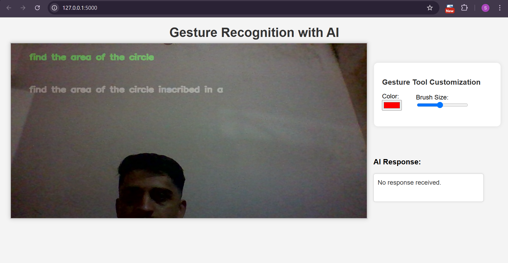
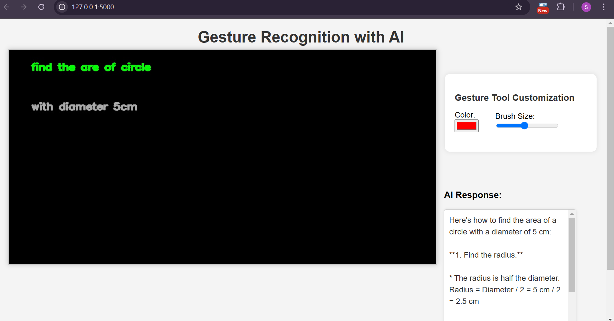

Modern Education Tool

Overview

The Modern Education Tool is an AI-powered interactive learning platform that enhances education by incorporating real-time handwriting recognition, NLP-based text correction, and AI-driven suggestions. The tool aims to improve learning efficiency and accessibility for students and educators.

Features

Handwriting Recognition: Real-time conversion of handwritten text into digital format with 90% accuracy.

NLP-based Text Completion: Suggests improvements for the next word.

Customizable UI: Users can adjust writer color, thickness, and background settings.

Voice Control Integration: Allows users to interact with the tool using voice commands.

Gemini API Integration: Provides real-time AI-powered doubt solving and assistance.

Installation

Prerequisites
Python 3.8+
pip
Virtual Environment (Recommended)

Dependencies:

pip install -r requirements.txt

Steps to Run

Clone the repository:

git clone https://github.com/your-repo/modern-education-tool.git](https://github.com/SKANDABH/METOOL

Navigate to the project directory:

cd modern-education-tool

Install dependencies:

pip install -r requirements.txt

Run the application:

python mn.py

Usage

Open the application in a browser (http://localhost:5000).
Write or draw using the handwriting interface.
Get instant digital conversion with text suggestions.
Utilize voice commands for hands-free interaction.
Export corrected text for further usage.

Expected Output

Handwriting Recognition
(Picture attached below)

 NLP-based Correction

AI-driven Suggestions

